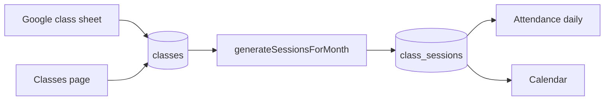
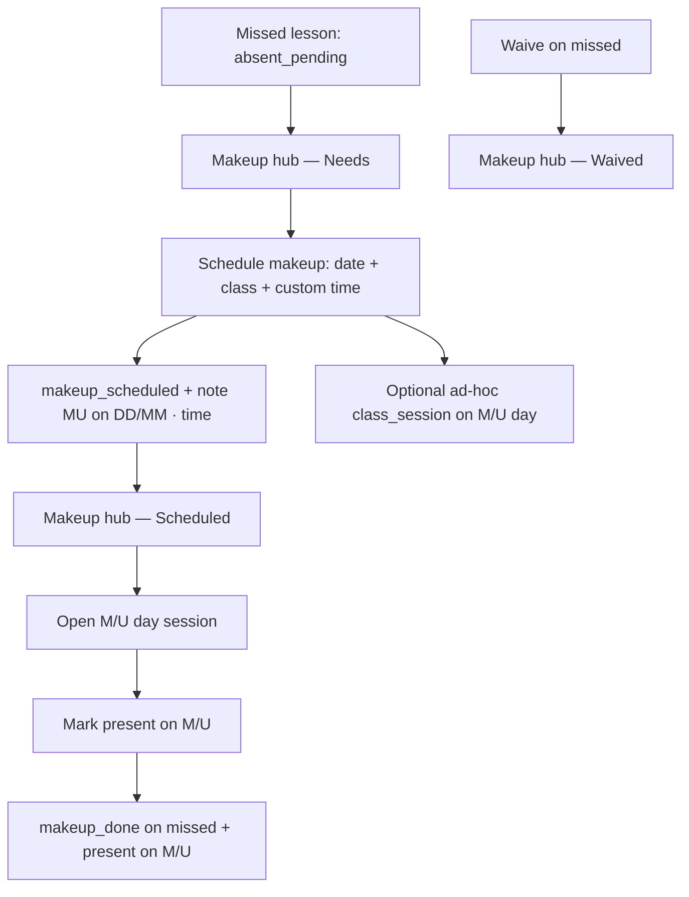

# KOM Admin — application manual

Onboarding guide for how **kom-billing** (KOM Admin at `admin.knockoutmath.sg`) is built, how the pieces connect, and how data flows. Written for a new developer or staff member who needs the system at a glance.

For local setup and env vars, see the root [README](../README.md).

---

## What this app is

Knockout Math’s **admin app** for:

1. **Roster** — students, classes, enrollments, trials  
2. **Attendance** — daily sessions, marking, makeups (M/U), calendar  
3. **Billing** — monthly invoices from **Google Sheets** (PDF + WhatsApp links)

**Production:** separate Vercel project, domain `admin.knockoutmath.sg`, repo [kom-admin](https://github.com/shuningwang00/kom-admin).

**Local:** `npm run dev` → http://localhost:3002 (kom-website uses port 3000).

---

## Two tracks of truth

| Track | Storage | Purpose |
|--------|---------|---------|
| **Attendance & makeup** | **Postgres** (`DATABASE_URL`) | Golden source for who attended, who missed, M/U bookings, waives |
| **Monthly billing** | **Google Sheets** (per month) | Invoice amounts, payment columns, PDF generation |

Attendance in the app is the operational source of truth for lessons. Billing sheets are loaded separately for invoicing; they are not fully auto-synced from every Postgres row today. Staff align sheet cells (e.g. `MU on 27/05`) with what was saved in the app.

---

## Roles and access

| Role | Who | Can access |
|------|-----|------------|
| **Owner** | `MASTER_ADMIN_EMAIL` or site password | Everything: classes, generate sessions, team access, makeup, billing |
| **Staff** | Google sign-in + allowlist `staff` | Attendance, makeup, trials, students, enrollments, billing — not classes CRUD or session generation |
| **Tutor** | Google sign-in + allowlist `tutor` + `tutor_match` | Own classes only: `/attendance/tutor` and by-day sessions |

Auth: site password (`BILLING_ADMIN_PASSWORD`) + optional Google OAuth. Team list: **Team access** (`/admin/teachers`) → `site_allowlist` table.

---

## Tech stack

- **Next.js** (App Router) — UI + API routes under `app/api/`
- **Postgres** — Drizzle ORM (`lib/db/schema.ts`, `lib/db/index.ts`)
- **Google APIs** — OAuth for Sheets (billing + class timetable sync)
- **Tailwind** — UI

Key library folders:

| Folder | Responsibility |
|--------|----------------|
| `lib/attendance/` | Sessions list, session detail, makeup, hub, consolidation, headcount |
| `lib/enrollments/` | Who is active on a given date |
| `lib/scheduling/` | Session generation, time-slot parsing |
| `lib/classes-sheet/` | Sync active classes from Google Sheet snapshot |
| `lib/sheets/` | Parse monthly billing spreadsheets |
| `lib/auth/` | Roles, access checks |
| `components/` | Page UI (attendance, makeup manager, students, etc.) |

---

## Database model (core tables)

```
students ──┬── enrollments ─── classes
           │                      │
           │                      └── class_sessions
           │                              │
           └── attendance_records ────────┘

trial_leads ──(convert)──► students
billing_groups ◄── students (optional)
site_allowlist — auth emails / tutor_match
audit_log — changes to attendance & sessions
```

### `students`

Name, contacts (`primary_contact`, `secondary_contact`), school, `start_date`, optional `billing_group_id`, `archived_at`.

### `classes`

Label (e.g. S1, S2), level, weekday, `time` (sheet style e.g. `615pm to 8pm`), tutor. Synced from Google Sheet or edited in **Classes**.

### `enrollments`

Links student ↔ class: `started_at`, `ended_at`, pause window, `trial_attended_at`, `free_trial`.

**Eligibility** (`lib/enrollments/eligibility.ts`) decides if a student appears on a session roster for a given date (registration start, withdrawal, pause, trial day).

### `class_sessions`

One row per class per calendar date (from **generate sessions**), or ad-hoc for custom makeups.

- `scheduled_date`, `time_label` (canonical form: `6:15pm – 8pm`)
- `reschedule_note` — empty for regular; `"Makeup session"` for ad-hoc M/U slots
- `relief_tutor` — when relief cover is needed

### `attendance_records`

Per student per session: `status`, `makeup_note`, `updated_by`.

Statuses include: `present`, `absent_pending`, `waive`, `pause`, `free_trial`, `makeup_scheduled`, `makeup_done`, `makeup_absent`.

**Staff saves** (`updated_by` = owner email, tutor email, `owner@site`, etc.) are treated as **billing truth** and are not auto-deleted on page load.

---

## How pages link together

| Route | What it does |
|-------|----------------|
| `/` | Redirects by role (tutor → tutor overview, else attendance) |
| `/login` | Site password |
| `/students` | Student roster |
| `/classes` | Class timetable (owner) |
| `/enrollments` | Student ↔ class links |
| `/attendance` | Pick date → list sessions (only classes with enrollments that day) |
| `/attendance/session/[id]` | Mark roster; schedule makeup (staff+) |
| `/attendance/tutor` | Tutor’s classes overview |
| `/makeup` | Hub: needs scheduling, scheduled, waived, relief tutor |
| `/trials` | Trial leads → convert to student |
| `/calendar` | Month calendar of sessions |
| `/billing` | Load Google Sheet → invoices / WhatsApp |
| `/admin/teachers` | Allowlist (owner) |

Shell layout: `components/app-shell.tsx` — left sidebar nav, role-filtered links.

---

## End-to-end workflows

### 1. Timetable → sessions



- Owner runs **generate sessions** for a month (`app/api/sessions/generate`).
- New sessions use **canonical** `time_label` from class time (`lib/scheduling/time-slots.ts`).

### 2. Daily attendance

```mermaid
flowchart TD
  Date[/attendance — pick date] --> List[listSessionsForDate]
  List -->|classes with active enrollments| Cards[Session cards + expected counts]
  Cards --> Open[/attendance/session/id]
  Open --> Roster[enrollments + eligibility]
  Roster --> Consolidate[peer slots same programme/time/tutor]
  Consolidate --> Save[Present / Waive / Pause / Free trial / M/U done]
  Save --> DB[(attendance_records + audit_log)]
```

- **Consolidation** (`lib/attendance/session-slot-matching.ts`): merges sibling sessions (e.g. two S2 groups same evening) for headcount and display.
- **Expected counts** (`lib/attendance/expected-counts.ts`, `session-headcount.ts`): who must be marked vs waived vs M/U visitor.

### 3. Makeup (M/U)



**Makeup note** should include custom time when off-timetable, e.g. `MU on 27/05 · 2pm – 3:45pm`, so hub and session times stay correct.

**Visibility rules** (`lib/attendance/makeup-session-rules.ts`, `session-roster-visibility.ts`):

- On **missed date**: student with `makeup_done` + note may be hidden from regular roster (marks on M/U day instead).
- On **M/U date**: shown as M/U visitor; not as a “missed link” on that same day.

**Relief tutor:** sessions can flag `relief_tutor`; hub lists **Relief tutor needed**.

### 4. Trials

1. Add lead in **Trials** → `trial_leads`.  
2. Optional: mark trial attendance on trial date.  
3. **Convert** → creates `students` + `enrollments` → appears on normal attendance rosters.

### 5. Billing

1. **Billing** → Connect Google → paste monthly spreadsheet ID.  
2. Parser reads weekday tabs, student rows, date columns (`1`, `Waive`, `MU on …`).  
3. Generate PDF invoice / WhatsApp link (`lib/whatsapp.ts`, `@react-pdf/renderer`).

Does not replace Postgres attendance; operators reconcile sheet with app marks.

---

## Data preservation (important)

Automatic repair/purge on page load is **disabled by default** so staff work is not lost.

| Setting | Effect |
|---------|--------|
| Default | No purge/repair when opening Makeup hub, attendance list, or session page |
| `ATTENDANCE_AUTO_REPAIR=true` | Opt-in only: legacy cleanup helpers may run |

**Rules** (`lib/attendance/data-preservation.ts`):

- `updated_by` = staff/tutor → **never** auto-deleted  
- `updated_by` = `system` or `system-repair` → disposable by maintenance tools only when opt-in  

**Do not** enable `ATTENDANCE_AUTO_REPAIR` in production unless running a deliberate one-off cleanup.

---

## Time labels

All slot strings normalize to **`6:15pm – 8pm`** (colon minutes, en-dash):

- Class sheet: `615pm to 8pm` → stored/displayed as `6:15pm – 8pm`
- Consolidation keys use normalized times so morning/evening slots do not merge incorrectly
- Custom M/U: embed time in makeup **note** and pick **custom** slot when scheduling

One-off DB alignment: `lib/scheduling/normalize-stored-time-labels.ts` (`normalizeAllStoredTimeLabelsInDb`).

---

## API surface (representative)

| Area | Routes |
|------|--------|
| Auth | `/api/auth/login`, `/api/auth/me`, `/api/auth/google`, `/api/auth/logout` |
| Health | `/api/health` |
| Students | `/api/students`, `/api/students/[id]` |
| Classes | `/api/classes` |
| Enrollments | `/api/enrollments`, `/api/enrollments/[id]` |
| Sessions | `/api/sessions`, `/api/sessions/generate`, `/api/sessions/[id]`, `/api/sessions/[id]/attendance` |
| Makeup | `/api/makeup`, `/api/sessions/makeup`, `/api/sessions/[id]/makeup-booking` |
| Trials | `/api/trials`, `/api/trials/[id]/convert` |
| Billing | `/api/billing`, `/api/invoices/pdf` |
| Admin | `/api/admin/teachers` |

Business logic lives in `lib/`, not only in route handlers.

---

## Deploy and database

1. Push to `kom-admin` → Vercel deploys `admin.knockoutmath.sg`.  
2. Set env vars from `.env.example` (especially `DATABASE_URL`, `BILLING_ADMIN_PASSWORD`, Google OAuth with production redirect).  
3. Align production schema: `DATABASE_URL=... npm run db:push` (or `db:migrate` for tracked migrations).  
4. Google Cloud: add redirect `https://admin.knockoutmath.sg/api/auth/google/callback`.

**Schema note:** `students.contact` was replaced by `primary_contact` / `secondary_contact` (migration `0003_student_contacts.sql`). Production app and DB must stay on the same version.

---

## Tests

```bash
npm test
```

Covers time parsing, consolidation keys, makeup visibility, headcount, data preservation, enrollment eligibility.

---

## UI: sidebar

`components/app-shell.tsx`:

- **Desktop:** sidebar open by default; thin collapsed rail with hamburger on sidebar; main header aligns `h-14` border with sidebar header.  
- **Mobile:** sidebar off-canvas; hamburger in top bar only; overlay drawer.

---

## Common pitfalls (from production debugging)

| Symptom | Likely cause |
|---------|----------------|
| `students.contact` query error | Old deploy against migrated DB — deploy latest + `db:push` |
| Every class on attendance list | Old code without enrollment filter — deploy latest |
| Wrong M/U time in hub | Note missing custom time; hub read class default from missed session |
| Missing makeups after navigation | Historical auto-purge (fixed); re-enter if lost; keep auto-repair off |
| Two sessions same day wrong merge | Corrupted `time_label` (e.g. 9am on evening slot) — fix session or reschedule |

---

## File map for deep dives

| Topic | Start here |
|-------|------------|
| Session list filter | `lib/attendance/list-sessions.ts` |
| Session page roster | `lib/attendance/session-detail.ts` |
| Schedule / complete makeup | `lib/attendance/makeup.ts`, `lib/attendance/makeup-booking.ts` |
| Makeup hub lists | `lib/attendance/makeup-hub.ts` |
| Slot merging | `lib/attendance/session-slot-matching.ts`, `merge-consolidated-sessions.ts` |
| Who appears on roster | `lib/enrollments/eligibility.ts`, `lib/enrollments/roster-query.ts` |
| Preservation | `lib/attendance/data-preservation.ts` |
| Time slots | `lib/scheduling/time-slots.ts` |
| Generate month | `lib/scheduling/generate-sessions.ts` |
| Class sync | `lib/classes-sheet/sync.ts` |
| Billing parse | `lib/sheets/` |

---

## Diagram: full system (reference)

```mermaid
flowchart TB
  subgraph external [External]
    GS_Classes[Google Sheet — class timetable]
    GS_Billing[Google Sheet — monthly billing]
    GAuth[Google OAuth]
  end

  subgraph auth [Auth]
    Login["/login"]
    Allowlist[(site_allowlist)]
    Roles[Owner / Staff / Tutor]
  end

  subgraph db [Postgres]
    Students[(students)]
    Classes[(classes)]
    Enroll[(enrollments)]
    Sessions[(class_sessions)]
    Attend[(attendance_records)]
    Trials[(trial_leads)]
  end

  subgraph ui [Pages]
    StudentsP[/students]
    ClassesP[/classes]
    EnrollP[/enrollments]
    AttendP[/attendance]
    SessionP[/attendance/session]
    MakeupP[/makeup]
    TrialsP[/trials]
    BillingP[/billing]
  end

  GAuth --> Login --> Roles --> ui
  GS_Classes --> Classes
  Students --> Enroll --> Classes
  Classes --> Sessions
  Enroll --> SessionP
  Sessions --> Attend
  SessionP --> Attend
  Attend --> MakeupP
  MakeupP --> Sessions
  TrialsP --> Students
  GS_Billing --> BillingP
```

---

*Last updated: May 2026 — reflects attendance preservation policy, sidebar UX, canonical time labels, and enrollment-filtered session list.*
